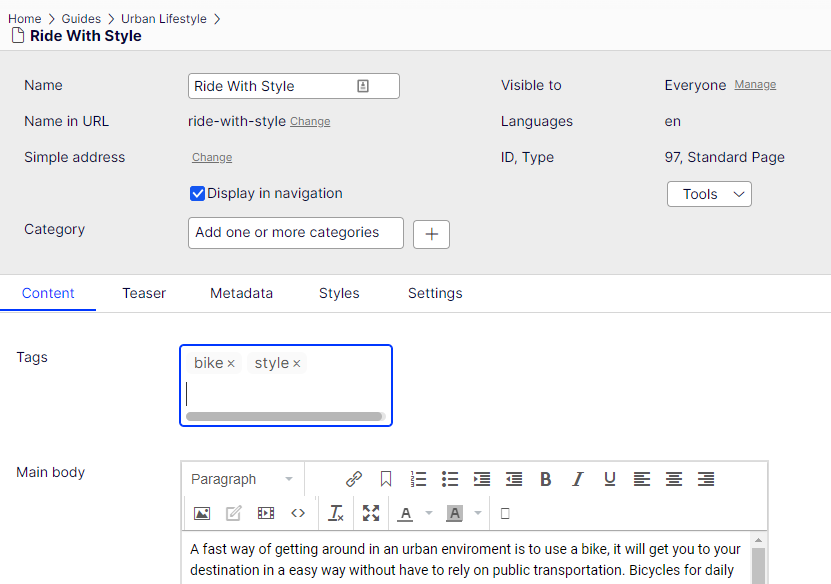
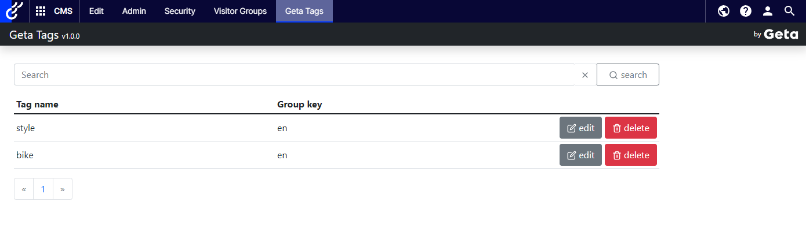
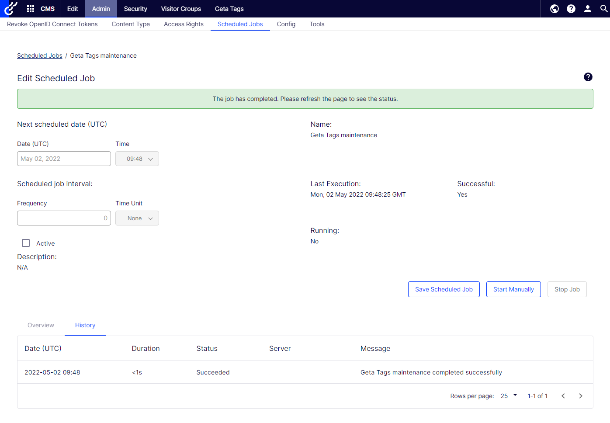

# Editor guide

## Tags property

Once the developer installed the package and defined a Tags property on a page or block the property will appear in the CMS.

In the text field, type a tag and press *Enter*. After pressing *Enter*, the tag is created. To remove the tag, click 'x' on the tag label.

## Geta Tags Management

In the Admin mode, Geta Tags management is available on the top menu. The management view provides ability to search, modify and delete a tag.

## Geta Tags maintenance scheduled job

A scheduled job that verifies all content - tag relations.

